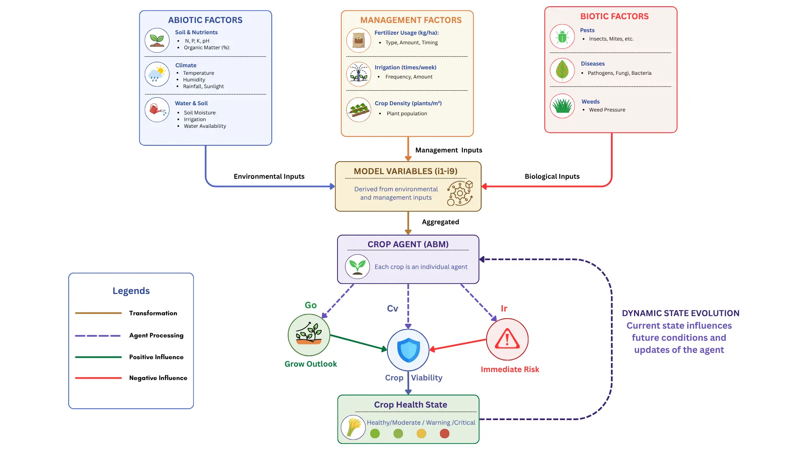
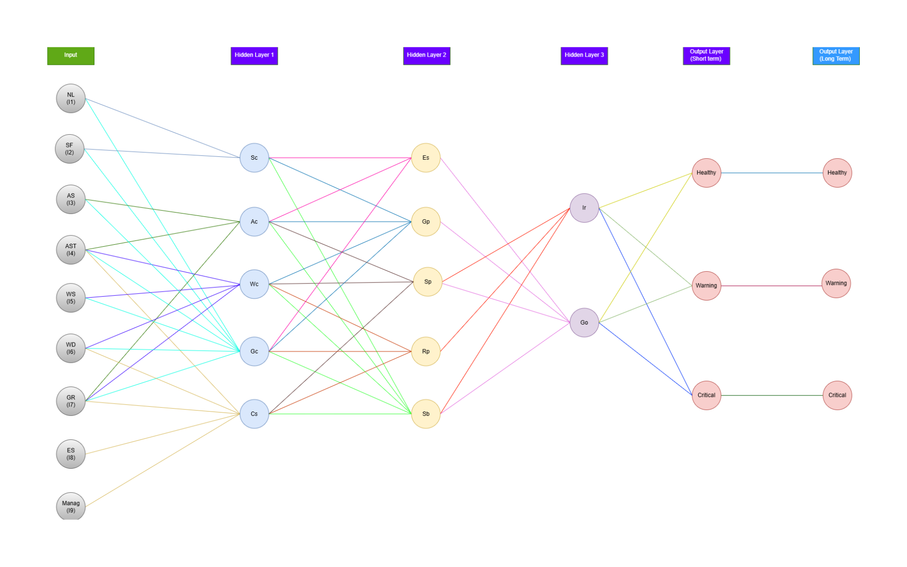

<div align="center">

# Smart Farming Crop Health

**Agent-Based Modeling for Crop Viability, Growth Risk, and Crop Health Simulation**


</div>

---

## Overview

**Agent-Based Crop Health Simulation** is a data analytics project that evaluates crop viability under dynamic environmental conditions. Each crop is represented as an individual agent whose growth, risk, and viability states evolve over time based on environmental, biotic, and management factors.

The system transforms smart farming variables into nine interpretable indicators (`i1`–`i9`), then processes them through a layered agent-based model to estimate **Growth Outlook (Go)**, **Immediate Risk (Ir)**, and **Crop Viability (Cv)**.

The project includes preprocessing, feature engineering, feature aggregation, agent-based modeling, and visual analytics of crop health behavior.

---

## Project Snapshot

| Area | Description |
|---|---|
| Domain | Smart farming / crop health analytics |
| Method | Agent-Based Modeling (ABM) |
| Dataset | Smart Farming Dataset 2024 |
| Main Inputs | Environmental, biotic, water, soil, and management factors |
| Core Indicators | `i1`–`i9` aggregated crop-condition signals |
| Main Outputs | `Go`, `Ir`, `Cv`, `LCv` |
| Goal | Simulate and analyze long-term crop viability under support and stress conditions |

---

## Project Summary

This repository studies crop health as a dynamic simulation-based analytics system, focusing on how crop conditions evolve over time under different environmental, biotic, and management factors.

The workflow transforms raw smart farming observations into structured environmental indicators, then simulates how each crop agent evolves over time through continuous interaction with environmental conditions.

The result is a structured analytics pipeline that connects:

- environmental measurements and farm context
- scientifically derived and aggregated features
- crop-level simulation dynamics
- interpretable outputs for growth, risk, and viability

This approach captures nonlinear and time-dependent crop–environment interactions, which cannot be fully represented using traditional static analysis.

---

## Theoretical Framework

This project is based on **Agent-Based Modeling (ABM)**, where each crop record is represented as an individual crop agent. Each agent has internal states such as growth condition, stress level, risk, and viability, which change over time based on environmental, biotic, and management factors.

The model treats crop health as a dynamic system rather than a one-time evaluation. Supportive conditions such as nutrients, water availability, and atmospheric support improve growth outlook, while stress factors such as water deficit, atmospheric stress, pests, and frost increase risk.

Crop viability emerges from the balance between growth support and stress pressure over time.

---

## Conceptual Framework

The conceptual framework shows how smart farming inputs are transformed into crop-agent states and final crop health outputs.



---

## Dataset

**Primary dataset:** Smart Farming Dataset 2024  
**Expected location:** `data/Smart Farming Dataset 2024.csv`

The dataset provides a multi-dimensional representation of crop conditions, including:

- **Soil & nutrients:** `N`, `P`, `K`, `ph`, `organic_matter`
- **Atmospheric conditions:** `temperature`, `humidity`, `rainfall`, `sunlight_exposure`, `wind_speed`, `co2_concentration`
- **Water-related variables:** `soil_moisture`, `irrigation_frequency`, `water_usage_efficiency`
- **Biotic stress:** `pest_pressure`, `frost_risk`
- **Contextual variables:** `soil_type`, `water_source_type`, `growth_stage`, crop `label`

Categorical variables are encoded, and continuous variables are normalized to ensure consistency for modeling.

---

## Workflow

The repository follows a structured three-stage workflow:

| Notebook | Purpose |
|---|---|
| `01_data_preprocessing.ipynb` | Handles missing values, encoding, normalization, and prepares the dataset for modeling |
| `02_feature_aggregation.ipynb` | Transforms raw and engineered features into nine interpretable indicators (`i1`–`i9`) |
| `03_modeling_and_results.ipynb` | Runs the agent-based simulation, computes model outputs, and generates result visualizations |

### Pipeline Overview

```txt
Smart Farming Dataset 2024
        ↓
Data Preprocessing
        ↓
Feature Engineering
        ↓
Feature Aggregation (i1–i9)
        ↓
Agent-Based Simulation
        ↓
Results and Analytics
```

---

## Feature Engineering and Aggregation

To improve interpretability and scientific relevance, the system includes engineered features such as:

- Temperature–Humidity Index (THI)
- Vapor Pressure Deficit (VPD)
- Growing Degree Days (GDD)
- Soil Moisture Deficit
- Nutrient ratios (N/P/K)

These features are aggregated into nine composite indicators:

| Indicator | Meaning |
|---|---|
| `i1` | Nutrient level and balance |
| `i2` | Soil context |
| `i3` | Atmospheric support |
| `i4` | Atmospheric stress |
| `i5` | Water support |
| `i6` | Water deficit |
| `i7` | Growth readiness |
| `i8` | Biotic and environmental stress |
| `i9` | Management context |

Each indicator represents a higher-level signal combining multiple raw inputs into interpretable support or stress components.

---

## Agent-Based Modeling Approach

Each row in the dataset is treated as an individual crop agent.

The model simulates the evolution of multiple internal states across condition, behavior, inference, and output layers.

### Model Architecture Flow

| Stage | Variables | Description |
|---|---|---|
| Input Layer | `i1`–`i9` | Aggregated crop-condition indicators |
| Condition Layer | `Sc`, `Ac`, `Wc`, `Gc`, `Cs` | Converts indicators into crop condition states |
| Behavior Layer | `Es`, `Gp`, `Sp`, `Rp`, `Sb` | Models suitability, growth, stress, risk, and stability |
| Inference Layer | `Go`, `Ir` | Estimates growth outlook and immediate risk |
| Output Layer | `Cv`, `LCv` | Calculates short-term viability and updates long-term viability |

### Condition Layer

- Soil Condition (`Sc`)
- Atmospheric Condition (`Ac`)
- Water Condition (`Wc`)
- Growth Condition (`Gc`)
- Contextual Sensitivity (`Cs`)

### Behavior Layer

- Environmental Suitability (`Es`)
- Growth Potential (`Gp`)
- Stress Pressure (`Sp`)
- Risk Propagation (`Rp`)
- Stability (`Sb`)

### Inference Layer

- Growth Outlook (`Go`)
- Immediate Risk (`Ir`)

### Output Layer

- Short-Term Crop Viability (`Cv`)
- Long-Term Crop Viability (`LCv`)

### Long-Term Dynamics

Long-term crop viability (`LCv`) evolves over time using a dynamic update mechanism.

---

## Model Architecture

The model architecture shows the layered structure of the simulation, from aggregated indicators (`i1`–`i9`) to condition states, behavior states, inference outputs, and long-term crop viability.



---

## Mathematical Model

The simulation follows a layered agent-based structure. Aggregated indicators (`i1`–`i9`) are first transformed into crop condition states, then into behavior states, and finally into short-term and long-term crop viability outputs.

The complete implementation is available in `src/model.py`.

### Model Layers

| Layer | Variables | Purpose |
|---|---|---|
| Input Layer | `i1`–`i9` | Aggregated environmental, biotic, and management indicators |
| Condition Layer | `Sc`, `Ac`, `Wc`, `Gc`, `Cs` | Represents soil, atmosphere, water, growth, and contextual sensitivity |
| Behavior Layer | `Es`, `Gp`, `Sp`, `Rp`, `Sb` | Represents suitability, growth potential, stress, risk, and stability |
| Inference Layer | `Go`, `Ir` | Estimates growth outlook and immediate risk |
| Output Layer | `Cv`, `LCv` | Represents short-term crop viability and long-term viability after time-based adaptation |

### Condition Layer Equations

```txt
Sc = σ1(i1) + σ2(i2)
```

```txt
Ac = (1 − i4) × [α2(i3) + (1 − α2)(i7)]
```

```txt
Wc = (1 − i5) × [α3(i6) + (1 − α3){β3(i4 + i7)}]
```

```txt
Gc = [1 − {δ4(i4) + (1 − δ4)(i6)}] × [α4(i7) + (1 − α4){β4(i5 + i3) + (1 − β4)λ4(i1 + i2)}]
```

```txt
Cs = α5(i8) + (1 − α5){β5(i4 + i6 + i9) + (1 − β5)λ5(i7)}
```

### Behavior Layer Equations

```txt
Es = α6(Sc + Ac) + (1 − α6)(Gc)
```

```txt
Gp = (1 − Wc) × [α7(Gc) + (1 − α7){β7(Sc + Ac)}]
```

```txt
Sp = (1 − Ac) × [α8(Wc + Cs)]
```

```txt
Rp = (1 − Gc) × [α9(Wc + Cs)]
```

```txt
Sb = [1 − {δ10(Wc) + (1 − δ10)(Cs)}] × [α10(Sc) + (1 − α10){β10(Ac + Gc)}]
```

### Inference Layer Equations

Growth Outlook (`Go`) represents expected growth under current conditions.

```txt
Go = (1 − Sp) × [α12(Es + Gp) + (1 − α12)β12(Sb)]
```

Immediate Risk (`Ir`) represents current system risk driven by stress and instability.

```txt
Ir = (1 − Sb) × [α11(Sp + Rp)]
```

### Output Layer Equation

Crop Viability (`Cv`) combines growth outlook and immediate risk.

```txt
Cv = Go × (1 − Ir)
```

This formulation reflects that:

- favorable environmental conditions increase growth potential
- stress factors increase risk
- viability depends on the balance between the two

### Long-Term Dynamic Update

The model incorporates temporal dynamics through long-term crop viability (`LCv`).

```txt
LCv(t + Δt) = LCv(t) + ηLCv[Cv(t) − LCv(t)]Δt
```

This update enables gradual adaptation and realistic simulation of crop health over time instead of instant state changes.

---

## Simulation Setup

| Parameter | Value |
|---|---|
| Total simulation steps | `T = 800` |
| Time step size | `dt = 0.01` |

At each time step:

1. indicators (`i1`–`i9`) are processed
2. condition and behavior states are updated
3. `Go` and `Ir` are computed
4. `Cv` is calculated
5. `LCv` is updated

This iterative process produces stable and interpretable system behavior.

---

## Outputs and Visualizations

Typical outputs include:

- crop viability classifications: Healthy, Moderate, Warning, Critical
- growth vs risk relationships
- time-series simulation plots
- feature-to-viability analytics
- correlation heatmaps
- quadrant plots for decision interpretation

### Key Outputs

| Output | Meaning |
|---|---|
| `Go` | Growth Outlook |
| `Ir` | Immediate Risk |
| `Cv` | Short-term Crop Viability |
| `LCv` | Long-term Crop Viability |

### Decision Framework

| Growth / Risk Condition | Crop State |
|---|---|
| High growth + low risk | Healthy |
| Low growth + low risk | Moderate |
| High growth + high risk | Warning |
| Low growth + high risk | Critical |

All visual outputs are saved in:

```txt
results/figures/
```

---

## Crop Health Classification

Final crop health is determined from long-term viability (`LCv`):

| Crop State | LCv Range |
|---|---|
| Healthy | `LCv ≥ 0.75` |
| Moderate | `0.55 ≤ LCv < 0.75` |
| Warning | `0.35 ≤ LCv < 0.55` |
| Critical | `LCv < 0.35` |

---

## How To Run

Create and activate a Python environment.

Install dependencies:

```bash
pip install -r requirements.txt
```

Place the dataset at:

```txt
data/Smart Farming Dataset 2024.csv
```

Run the notebooks in order:

```txt
notebooks/01_data_preprocessing.ipynb
notebooks/02_feature_aggregation.ipynb
notebooks/03_modeling_and_results.ipynb
```

---

## Repository Structure

```txt
smart-farming-crop-health/
├── README.md
├── notebooks/
│   ├── 01_data_preprocessing.ipynb
│   ├── 02_feature_aggregation.ipynb
│   └── 03_modeling_and_results.ipynb
├── src/
│   ├── data_preprocessing.py
│   ├── feature_aggregation.py
│   ├── model.py
│   └── visualization.py
├── docs/
│   └── images/
│       ├── conceptual_framework.png
│       └── model_architecture.png
├── results/
│   └── figures/
├── data/
├── requirements.txt
└── .gitignore
```

---

## Notes

This project emphasizes:

- simulation-based data analytics
- interpretability over black-box prediction
- dynamic simulation over static analysis
- integration of environmental, biological, and management factors
- transparent mathematical modeling for crop health analytics